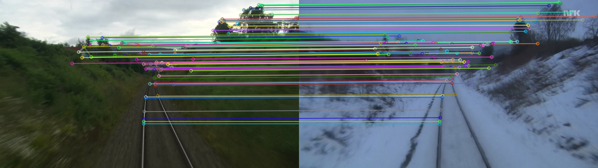

# Cross-Season Visual Localization using SuperPoint and LightGlue

## Project Overview

This project addresses the challenge of robust visual localization under extreme seasonal appearance changes using the Nordland Dataset.

The objective is to match corresponding Summer and Winter railway images, estimate a robust geometric transformation, and align the Summer image onto the Winter image using Homography estimation.

The implementation uses:

- SuperPoint for feature extraction
- LightGlue for feature matching
- USAC_MAGSAC RANSAC for robust homography estimation
- PyTorch with CUDA acceleration
- OpenCV for geometric transformation and image warping

---

## Dataset

Dataset: Nordland Dataset (Summer-Winter)

Dataset Statistics:

- Summer Images: 1750
- Winter Images: 1750

Each Summer image has a corresponding Winter image captured at the same location.

---

## Project Pipeline

1. Feature Extraction using SuperPoint
2. Feature Matching using LightGlue
3. Outlier Rejection using USAC_MAGSAC
4. Homography Estimation
5. Perspective Warping
6. Performance Profiling and Optimization

---

## Design Decisions

### Why SuperPoint + LightGlue?

The task involves matching images across extreme seasonal variations, where traditional handcrafted features often struggle due to changes in lighting, snow coverage, vegetation, and scene appearance.

SuperPoint was selected because it learns robust and repeatable keypoints and descriptors that generalize well across seasonal changes.

LightGlue was chosen as the matcher because it provides efficient transformer-based feature matching while maintaining high matching accuracy on challenging image pairs.

### Why USAC_MAGSAC?

Although deep feature matching significantly reduces mismatches, some outliers remain. USAC_MAGSAC was used for robust homography estimation because it provides stronger outlier rejection compared to standard RANSAC.

### Why GPU Acceleration?

The pipeline performs deep neural network inference for feature extraction and matching. Running the pipeline on an NVIDIA RTX 4060 GPU significantly reduces processing time compared to CPU execution.

---

## Repository Structure

```text
.
├── notebooks/
│   ├── Setup & Environment Verification.ipynb
│   ├── Task1_Matching.ipynb
│   ├── Task3_Homography.ipynb
│   └── Task4_Optimization.ipynb
│
├── src/
│   ├── Task1_Matching.py
│   ├── Task2_Homography.py
│   └── Task3_Optimization_profiling.py
│
├── outputs/
│   ├── match_visualizations/
│   ├── warped_images/
│
├── requirements.txt
└── README.md
```

---

## Environment

Hardware:

- Lenovo Legion Laptop
- NVIDIA RTX 4060 Laptop GPU

Software:

- Python 3.11
- PyTorch
- OpenCV
- LightGlue
- SuperPoint

---

## Installation

Clone the repository:

```bash
git clone <repository-url>
cd Cross-Season-Visual-Localization
```

Install dependencies:

```bash
pip install -r requirements.txt
```

---

## Running the Project

Run the notebooks sequentially:

### Task 1

Feature Extraction and Matching

```bash
Task1_Matching.ipynb
```

### Task 2

Homography Estimation and Image Warping

```bash
Task2_Homography.ipynb
```

### Task 3

Optimization and Latency Profiling

```bash
Task3_Optimization.ipynb
```

---

# Results

## Task 1: Feature Matching

Best Inlier Ratios:

| Frame | Inlier Ratio |
|---------|---------:|
| 250 | 0.779 |
| 625 | 0.758 |
| 1600 | 0.774 |
| 1625 | 0.941 |
| 1650 | 0.875 |

Requirement:

```text
Inlier Ratio ≥ 60%
```

Result:

```text
Maximum Inlier Ratio = 94.1%
```

Requirement satisfied.

---

## Task 2: Homography Estimation

Reprojection Error Results:

| Frame | Reprojection Error (px) |
|---------|---------:|
| 250 | 1.25 |
| 625 | 1.00 |
| 1600 | 0.94 |
| 1625 | 0.27 |

Requirement:

```text
Corner Alignment Error < 5 pixels
```

Result:

```text
Minimum Reprojection Error = 0.27 px
```

Requirement satisfied.

---

## Task 3: Optimization

Optimization techniques applied:

### 1. CUDA Acceleration

Enabled GPU execution using NVIDIA RTX 4060.

### 2. Reduced Image Resolution

Images resized before feature extraction.

### 3. Reduced Keypoints

Maximum SuperPoint keypoints reduced to improve runtime.

### 4. Inference Optimization

Used:

```python
torch.no_grad()
```

to disable gradient computation during inference.

### 5. Performance Mode

System configured in high-performance mode during benchmarking.

---

## Latency Profiling Results

| Frame | Loading (ms) | Feature (ms) | Matching (ms) | Homography (ms) | Total (ms) |
|---------|---------:|---------:|---------:|---------:|---------:|
| 250 | 7.65 | 40.99 | 16.27 | 0.32 | 65.23 |
| 625 | 7.29 | 40.48 | 20.70 | 0.36 | 68.82 |
| 1600 | 9.82 | 40.61 | 21.82 | 0.20 | 72.45 |
| 1625 | 4.45 | 40.17 | 22.19 | 0.39 | 67.20 |

Average Latency:

68.43 ms

Minimum Latency:

65.23 ms

Maximum Latency:

72.45 ms

---

## Output Files

The repository includes:

### Match Visualization Frames

```text
outputs/match_visualizations/
```

Contains:

- 5 feature matching visualizations

### Warped Alignment Images

```text
outputs/warped_images/
```

Contains:

- 5 homography warped alignment results

---

## Sample Results

### Feature Matching Example



### Homography Alignment Example


## Conclusion

The SuperPoint + LightGlue pipeline successfully performs robust cross-season image matching and geometric alignment under significant appearance changes between Summer and Winter conditions.

Key achievements:

- Maximum Inlier Ratio: 94.1%
- Minimum Reprojection Error: 0.27 px
- Average Runtime: 68.43 ms
- GPU Accelerated using RTX 4060

The system demonstrates accurate and reliable visual localization across extreme seasonal variations.
